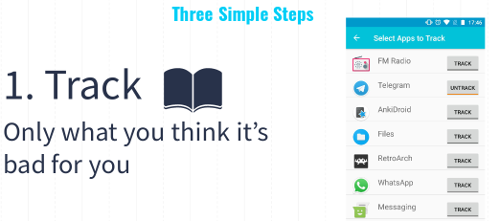
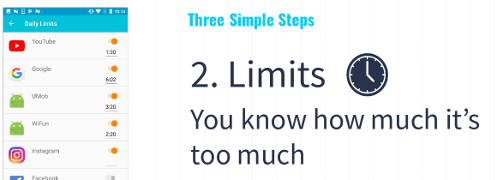
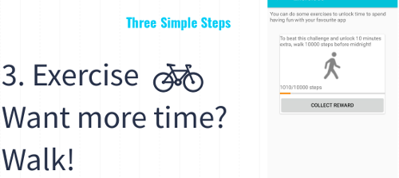

# Android_Ma_Quanto_Lo_USI

Group project for the mobile computing class 2017-2018

__Ma Quanto Lo USI__ is an android app tracker with an innovative reward system that encourage physical mobility to unlock more time for your app!

